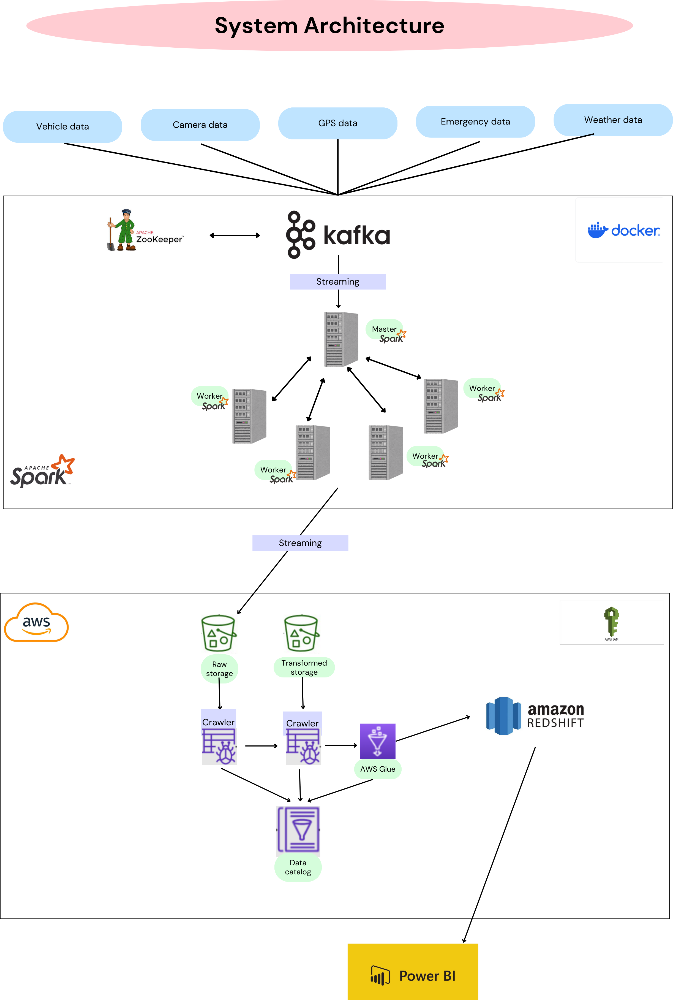

# UrbanFlow Data Pipeline

The **UrbanFlow Data Pipeline** is a smart city initiative designed to stream, process, and visualize real-time data from IoT devices deployed across urban environments. This project focuses on collecting and analyzing dynamic data such as GPS locations, traffic conditions, weather updates, and emergency incidents to provide timely and actionable insights for travelers navigating city routes.

## Key Features:

- **Real-Time Data Streaming:** Collects data from IoT devices such as weather stations and GPS systems.
- **Data Processing & Analysis:** Detects patterns, trends, and critical updates in real-time.
- **Visualization:** Displays traffic, weather, and emergency updates on intuitive dashboards.
- **Route Optimization:** Provides optimal routes for travelers based on current data.

